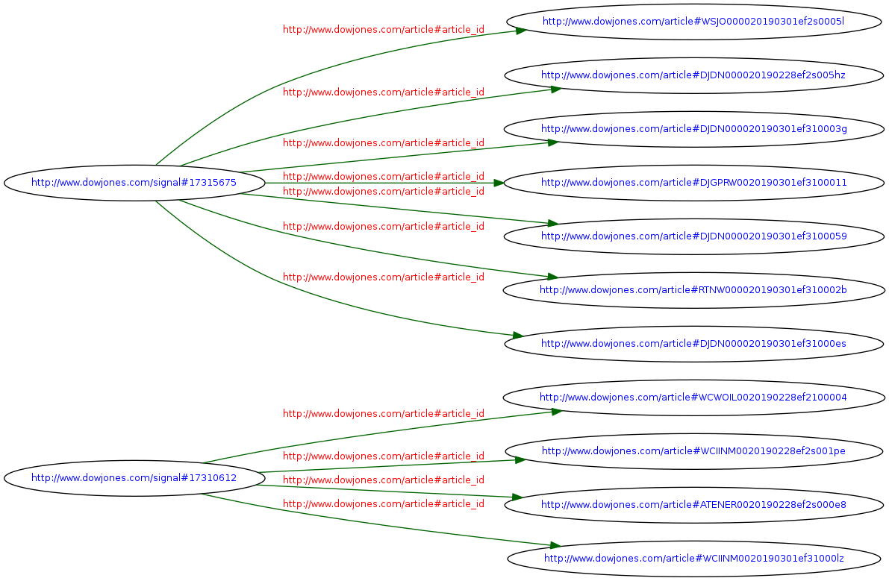
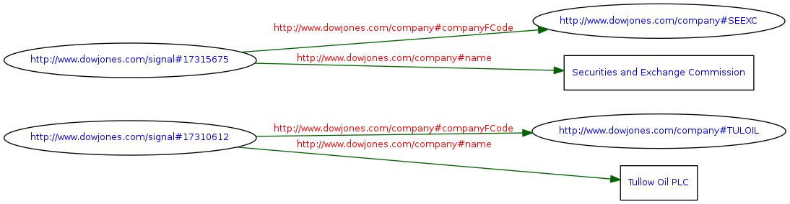
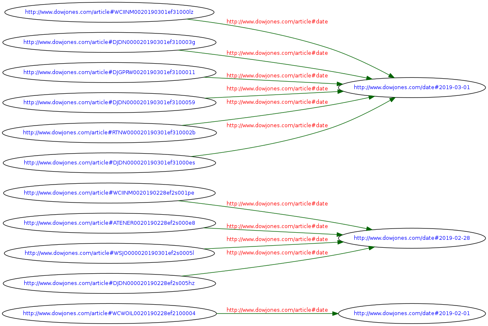

# Graph Challenge
As someone who wants to see how M&A activity effects management changes I want to import signals that have been derived from news content into a graph. Please take the signals below structured in a standardized XML format, and generate RDF files in an RDF format of your choosing. (You only need to model out 3 - 4 relationships.)

## XML Files
There is a small sample provided in this repo under `/graph-challenge/samples/`.
To obtain the original set of documents please refer to the original challenge repo.

## Script solution usage
The chosen RDF format was [RDF/XML](https://www.iro.umontreal.ca/~lapalme/ForestInsteadOfTheTrees/HTML/ch07s01.html) and a tool to parse the source file was created using Python [`xsml`](https://lxml.de/xpathxslt.html#xslt) library.

1. Create a virtualenv by running the setup script.

```
    ./setup.sh
```

2. When completed activate it with the virtualenvwrapper `workon dowj-rdf-parser` command.


3. To test the parser run the commands providing the right input, output and xslt file parameters.

```
    python parser.py -h
```

- Here is an example which created the one RDF/XML file under `graph-challenge/output/`

```
python parser.py -i samples/sample_managers.xml -o rdf_of_sample.managers.xml -p xslt/gen_signal_article.xml
```

4. When finish deactivate the environment by typing `deactivate` command.

## Modeled relationships
Triples were validated using an [RDF Validatior](https://www.w3.org/RDF/Validator/rdfval)
---
- ### Signal - Articles

---
- ### Signal - Companies

---
- ### Articles - Date

